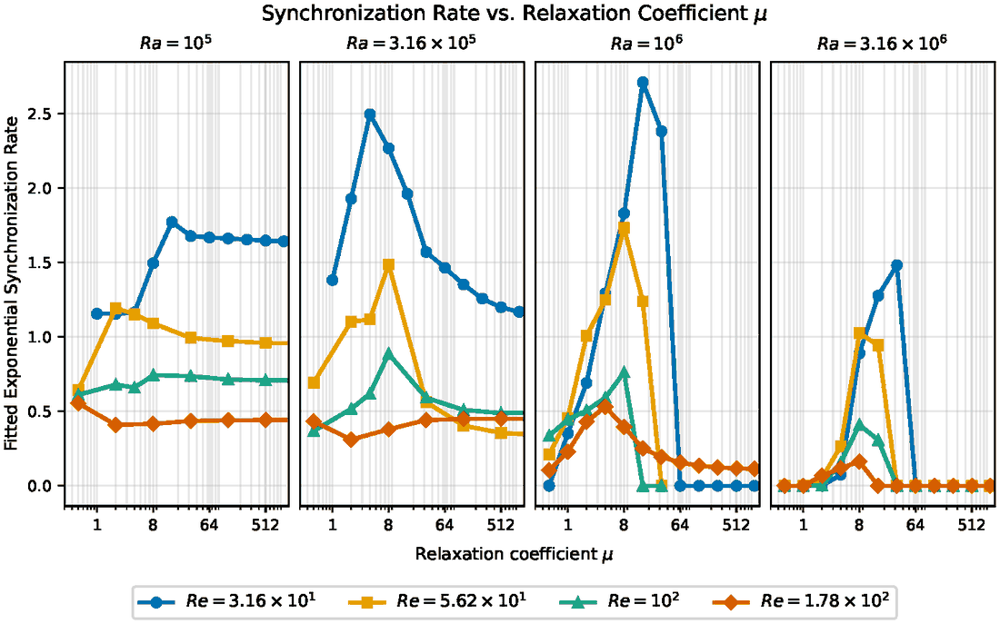
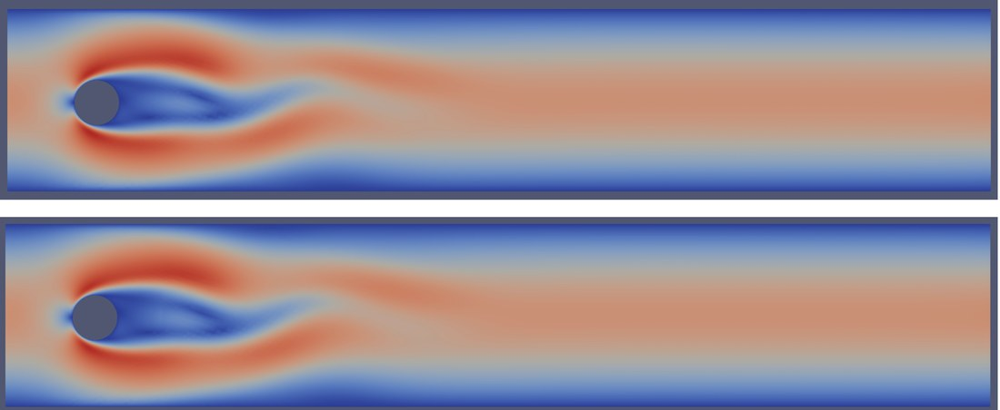
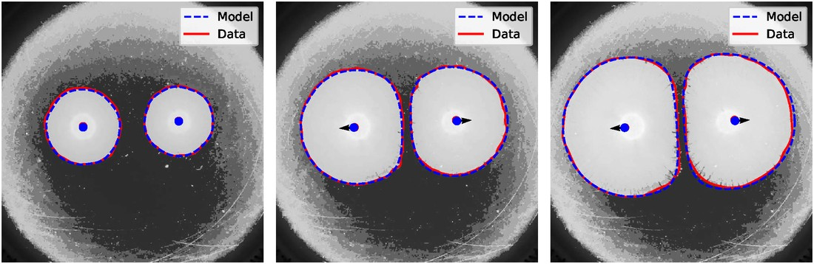
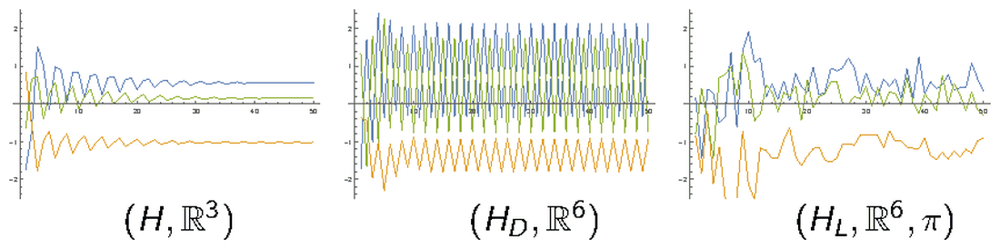
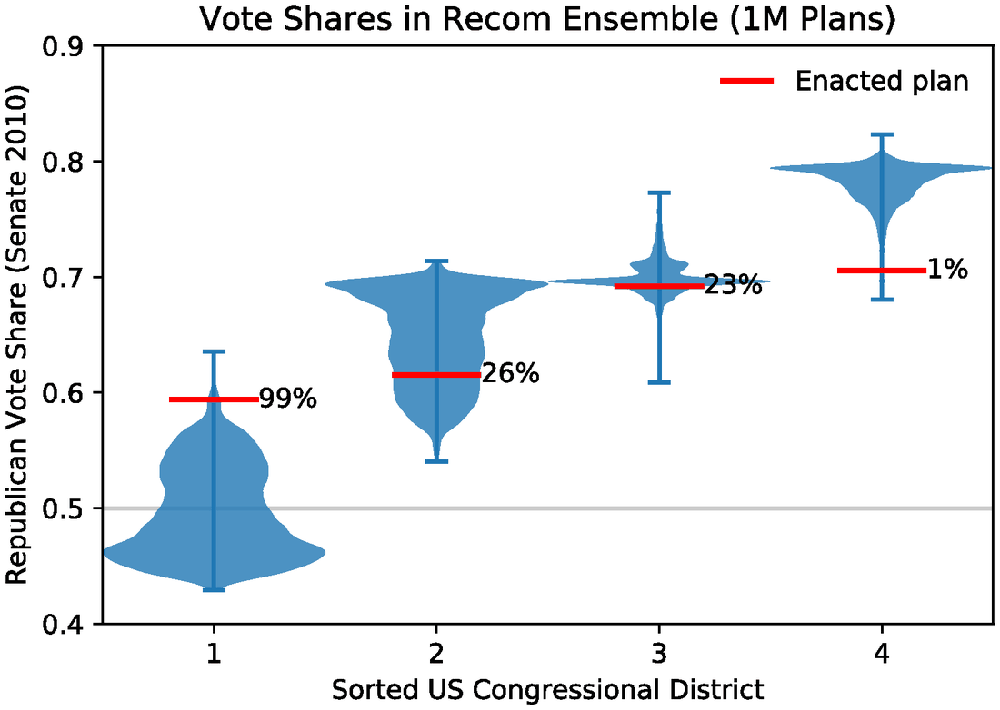
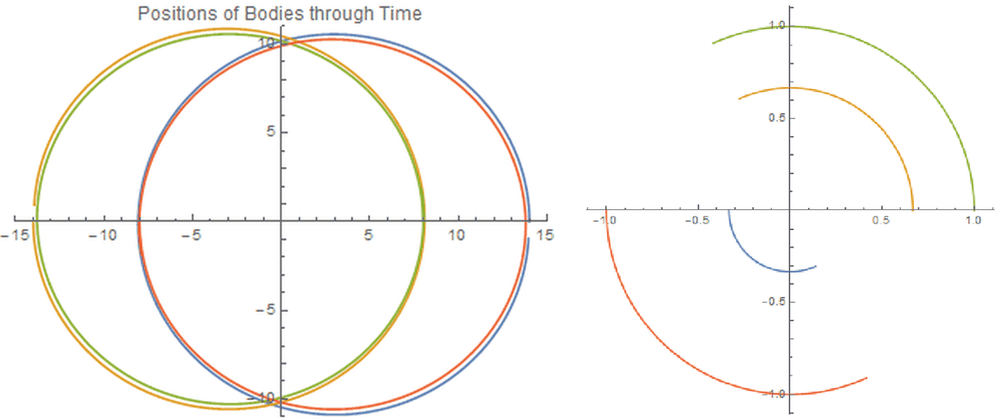

Nonlinear PDEs model many complex physical systems, but simulating them
forward usually needs information that is missing in practice — the full
initial state, the model parameters — or a fully resolved solver that is too
expensive for the application. My research uses data to build PDE models that
can still make forward predictions under those constraints: data assimilation
to recover the state from partial observations, inverse methods to recover
unknown parameters, and reduced-order models to bring down the cost. The three
projects below apply these ideas to convection, to incompressible flow past
obstacles, and to a nonlocal model of bacterial growth.

<nav class="section-nav" aria-label="On this page">
  <a href="#data-assimilation-for-convection">Convection</a>
  <a href="#reduced-order-models-for-flow-around-obstacles">Reduced-order models</a>
  <a href="#learning-interaction-kernels-for-bacterial-colonies">Bacterial colonies</a>
  <a href="#undergraduate-research">Undergraduate research</a>
</nav>

## Data assimilation for convection

Many problems in science and engineering call for reconstructing the full state
of a flow from partial observations. Continuous data assimilation, or
*nudging*, does this by adding a feedback term to the model. For a system
$du/dt = G(u)$, the assimilating system is

$$\frac{d\tilde{u}}{dt} = G(\tilde{u}) - \mu\, I_h(\tilde{u} - u),$$

where $I_h$ interpolates onto the observed part of the state and $\mu$ sets the
relaxation rate. When enough is observed and $\mu$ is chosen well,
$\tilde{u}$ converges to $u$ — including in the components that are never
observed directly.

My current work, with collaborators at the Nevada National Security Sites,
asks how much of a flow can be recovered when only *temperature* is observed.
The setting is mixed convection in a ventilated room, governed by the
Boussinesq equations: cool air enters through an inlet, and a heated object on
the floor drives buoyant circulation. Temperature sensors are cheap and can be
embedded in walls or equipment, while velocity probes are intrusive, so a
temperature-only filter would be practically valuable. In the assimilating
system only the temperature is nudged; the velocity is never observed and is
recovered entirely through the buoyancy coupling.

{fig-alt="Three panels of a ventilated-room flow with a heated obstacle: the reference temperature field with velocity arrows, the assimilating field, and the velocity error magnitude." width="88%"}

The central finding is that synchronization depends *nonmonotonically* on
$\mu$. Existing nudging theory guarantees recovery once $\mu$ is large enough,
but across a grid of Rayleigh and Reynolds numbers we find both a lower and an
upper threshold, and the window between them narrows as the Rayleigh number
grows, closing entirely at $\mathrm{Ra} = 10^7$. To explain the upper
threshold I analyzed a Lorenz '63 model in which only the temperature-like
variable is observed: as $\mu \to \infty$ the error dynamics collapse onto a
linear cocycle whose largest Lyapunov exponent is positive, so synchronization
must fail in that limit. In the other direction, I proved a local exponential
synchronization theorem that holds on a two-sided window of $\mu$.

{fig-alt="Four line plots, one per Rayleigh number, of synchronization rate versus relaxation parameter mu on a log axis, each with several Reynolds numbers; the curves rise, peak, and at higher Rayleigh number drop to zero."}

The simulations run on a finite-element solver I wrote in FEniCSx/DOLFINx that
advances the reference and assimilating flows in lockstep on unstructured
meshes, with MPI-parallel assembly and PETSc multigrid-preconditioned solvers,
across 25 combinations of Rayleigh and Reynolds number and relaxation
parameters spanning several orders of magnitude.

This project grew out of my
[master's thesis](https://scholarsarchive.byu.edu/etd/9714/) on
Rayleigh–Bénard convection and the
[joint work with Vincent Martinez and Jared Whitehead](https://arxiv.org/abs/2408.14296)
that followed it, published in *Inverse Problems*. There the question was how
to recover unknown *parameters* alongside the state. We derived two
nudging-based parameter-recovery algorithms from first principles — one as a
relaxation Newton iteration, the other as a relaxation least-squares scheme —
and gave structural conditions under which they converge. On two-dimensional
Rayleigh–Bénard convection, both recover the Rayleigh and Prandtl numbers
together with the full state from low-mode observations.

[Talks: [APS Division of Fluid Dynamics, 2025](/talks/dfd-2025-convection.pdf) ·
[Thesis defense, 2022](/talks/thesis-defense-2022.pdf) ·
[BYU Student Research Conference, 2022](/talks/src-2022-convection.pdf) (best presentation in session)]{.project-meta}

## Reduced-order models for flow around obstacles

Digital twins of physical assets need forward models that are accurate to
within a few percent and cheap enough to run repeatedly, so a fully resolved
simulation is frequently neither necessary nor affordable. Reduced-order
models built from proper orthogonal decomposition address this by projecting
the equations onto a data-driven basis, but they need the state to lie near a
low-dimensional subspace, and they generalize poorly to geometries unseen
during training.

During a 2024 internship at the Nevada National Security Sites, working with
Sean Breckling and collaborators at the Special Technologies Laboratory, I
developed a hybrid scheme for Navier–Stokes flow through a domain punctured by
circular obstacles. Reduced-order models are deployed only on congruent square
subregions surrounding each obstacle, with a full-order model retained
everywhere else. Because the subregions are congruent, a single training
simulation supplies one useful snapshot per obstacle per time step, and the
resulting basis transfers to obstacle configurations that never appeared in
the training data. The two regions are coupled through a discontinuous
Galerkin domain decomposition with $H(\mathrm{div})$-conforming elements, so
interface conditions are imposed weakly and mass is conserved across the
boundary, and the reduced degrees of freedom are advanced by a least-squares
Petrov–Galerkin scheme that minimizes the residual at each step.

{fig-alt="Two horizontal channel-flow panels colored by speed, showing a wake behind a circular obstacle; the full-order and hybrid results are visually indistinguishable."}

Numerical experiments indicate that the hybrid scheme reproduces full-order
flow at reduced cost in both time and memory; a manuscript is in preparation.
The collaboration has continued through an NNSS grant to UCLA, which supports
the convection project above.

## Learning interaction kernels for bacterial colonies

Colonies of *Paenibacillus dendritiformis* communicate over long distances by
releasing a lethal factor that inhibits the growth of neighboring colonies.
This produces a striking "stationary fronts" phenomenon in which two nearby
colonies arrest each other's growth. A previously developed model captures
this by tracking colony boundaries as evolving planar contours, driven by
curvature, a constant growth rate, and nonlocal self- and cross-interaction
forces. The interaction kernels behind those forces cannot be derived from
first principles, so in joint work with experimentalists at Montana State
University's Center for Biofilm Engineering I posed their recovery as an
inverse problem against image sequences of growing colonies. The project began
at the 2023 UCLA Computational and Applied Mathematics REU, where I mentored
the undergraduates who prototyped the first image-processing and simulation
tools.

Two modeling contributions came out of this. I generalized the governing
equations to admit a nonlocal transport force acting along the axis between
colony centroids — not restricted to the normal direction, as in classical
geometric flows — which substantially reduced model error at the cost of two
additional parameters. And I introduced a class of "ramp" interaction kernels
that outperform the Gaussian kernels proposed in earlier work. Recovering the
kernels also meant building the surrounding pipeline: a seeded-region-growing
segmentation that extracts smooth contours where false edges and fine
"feathering" defeat simple thresholding, a tangent-angle formulation of the
contour dynamics that isolates the stiff curvature term so the contours can be
advanced pseudospectrally, and a derivative-free optimization over the model
parameters, since reparametrization and interpolation inside each time step
make the forward solver non-differentiable.

{fig-alt="Three grayscale petri-dish frames showing two growing bacterial colonies, with dashed model contours closely tracking solid data contours and the boundary between the colonies flattening as they meet."}

The trained models track experimental colony boundaries with average relative
losses of 9–17% on the two-colony datasets and reproduce the stationary
fronts phenomenon. A manuscript is in preparation.

## Undergraduate research

As an undergraduate at Brigham Young University I worked on three projects,
two of which led to journal publications.

### Stability of stochastic switched systems

[With Benjamin Webb, Camille Carter, and David Reber · 2020–2021]{.project-meta}

In a switched system the rule governing the dynamics changes over time, and
the switching itself can be a source of instability. We gave a simple
sufficient criterion for a system with i.i.d. stochastic switching to be
stable in expectation, extending earlier results for linear switched systems
to the nonlinear case. We also introduced *patient stability* — stability
that survives the introduction of time delays, which are intrinsic to any
real system — and gave a criterion for it in the stochastically switched
setting. Both criteria sidestep the Lyapunov, linear-matrix-inequality, and
semidefinite-programming machinery usually needed for such results.

{fig-alt="Three time-series panels: decaying trajectories on the left, sustained oscillations in the center, and irregular oscillations on the right."}

[[Paper in *Nonlinearity*](https://doi.org/10.1088/1361-6544/ac9505) ·
[Talk at the BYU Student Research Conference, 2021](/talks/src-2021-switched-systems.pdf)
(best undergraduate presentation in session)]{.project-meta}

### Gerrymandering in Utah

[With Tyler J. Jarvis, Annika King, Jake Callahan, and Adrienne Russell · 2019–2021]{.project-meta}

We investigated whether Utah's 2011 congressional map is a partisan
gerrymander by generating large ensembles of alternative districting plans
with Markov chain Monte Carlo sampling, then using the ensembles to evaluate
the standard measures of partisan fairness in a state with at most one
competitive district. In that setting most of the usual metrics are
uninformative, so we proposed a new one — the Republican vote share in the
least-Republican district — which turns out to be very effective for
quantifying gerrymandering there. I built the sampling pipeline and obtained,
processed, and cleaned the geographic and election data.

{fig-alt="Violin plot of Republican vote share for four sorted congressional districts across one million sampled plans, with the enacted plan marked in red at the 99th, 26th, 23rd, and 1st percentiles." width="82%"}

[[Paper in *Statistics and Public Policy*](https://doi.org/10.1080/2330443X.2022.2105770) ·
[Code](https://github.com/jwmurri/MathematicalElectionAnalysis) ·
Talks at the BYU Student Research Conference,
[2020](/talks/src-2020-gerrymandering.pdf) and
[2021](/talks/src-2021-gerrymandering.pdf) (best undergraduate presentation
in session, both years)]{.project-meta}

### Celestial mechanics

[With Lennard Bakker · 2017 and 2019–2021]{.project-meta}

I first used numerical experiments in Mathematica to construct
*exchange orbits* in symmetric $N$-body problems — periodic solutions in
which two bodies swap orbital characteristics, as Saturn's moons Janus and
Epimetheus do — by layering Kepler orbits with the right symmetry. Returning
to the project later, I studied a simplified four-body problem in which two
small bodies move in the gravitational field of two primaries on Kepler
orbits — a model for a binary asteroid pair that sits between the restricted
three-body problem and the full four-body problem. I proved existence and
uniqueness of collinear equilibrium orbits in each of the possible orderings
of the bodies, and examined their stability through the spectrum of the
linearized Hamiltonian system.

{fig-alt="Left: four colored orbital traces forming two overlapping circles. Right: four circular arcs about the origin, one per body, at different radii."}

[Talks at the BYU Student Research Conference,
2017 and [2020](/talks/src-2020-four-body.pdf) (best undergraduate
presentation in session, both years)]{.project-meta}

<!--
  Figures live in images/. Each is a Quarto figure: the bracketed text is the
  caption and fig-alt is the screen-reader description. Captions are styled in
  custom.scss under "figures".
-->
